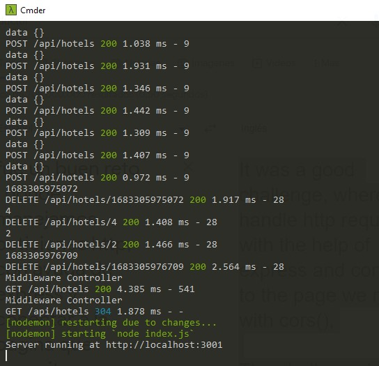

# Make It Real - MiPrimeraAPIExpress


solution to my first api

## Table of contents

## Table of contents

- [Overview](#overview)
  - [The challenge](#the-challenge)
  - [Screenshot](#screenshot)
- [My process](#my-process)
  - [Built with](#built-with)
  - [What I learned](#what-i-learned)
  - [Continued development](#continued-development)
  - [Useful resources](#useful-resources)
- [Author](#author)
- [Acknowledgments](#acknowledgments)


## Overview :
-the first api is created where we can make different requests through espress(). and some bookstores

### The challenge

-It was a good challenge, where we handle http requests, with the help of express and connect to the page we need with cors(),

The challenge is to have a table with the help of

"@makeitrealcamp/db-mock" to simulate a database and take the data to our rect project, in this case take it to the console.

### Screenshot




## My process


### Built with

-express
-javascript
-cors()
-express.json()

### What I learned


create a pi, where a server communicates with our program in react,
we leave an example:

```js
app.get('/api/hotels', handleGetAllData)

  function handleGetAllData(req, res) {
    console.log('Middleware Controller')
    const records = getAllData()
  
    return res.json(records)
  }

  function getAllData() {
  const records = table.findAll()

  return records
}

```

### Continued development
- I will continue practicing to have a better handling of DOM, studying and consulting my mentors so that every day I improve my knowledge.

 ### Useful resources
- https://classroom.makeitreal.camp/courses/82/topics/353/progress -- This helped me I will use it in the future.
-https://www.semrush.com/blog/http-status-codes/?kw=&cmp=LM_SRCH_DSA_Blog_EN&label=dsa_pagefeed&Network=g&Device=c&utm_content=622526966308&kwid=dsa-1754723155433&cmpid=18364824154&agpid=146618527572&BU=Core&extid=60109657981&adpos=&gclid=Cj0KCQjw0tKiBhC6ARIsAAOXutmpFVwz9Xxe2-UA05kprXEYyPtDN1_lJg_RVv-DwILp4hj596HnYBwaAtvDEALw_wcB
-https://expressjs.com/en/resources/middleware/cors.html

## Author

- email - [guialexander1@gmail.com]
- Twitter - [@guialexander1](https://www.twitter.com/guialexander1)

## Acknowledgments

-I want to thank the make it real family since it has given me a new vision of my working life to improve and get out of the comfort zone and know that we can give more than what we already know
